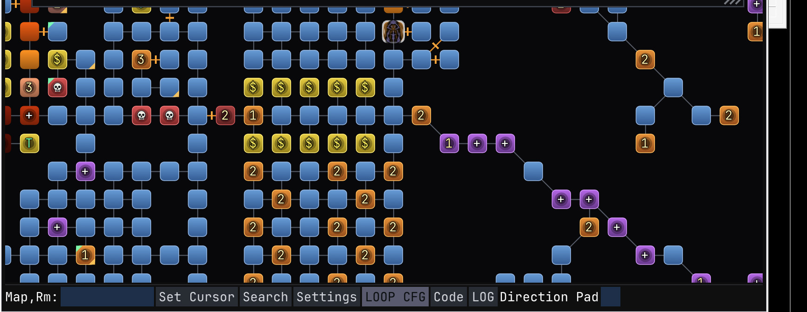
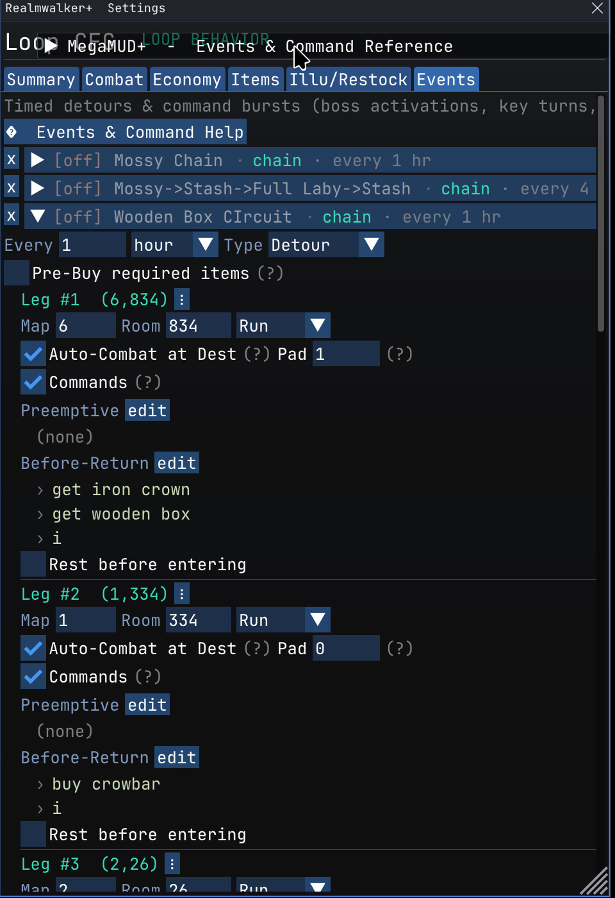

# MMud+

**MMud+ is a modular overlay for MegaMMUD 2.0.5 by Syntax** — a closed-source
proxy + plugin suite that adds a modern in-game experience without modifying the
MegaMUD client itself. It layers on top of an existing MegaMUD install and can be
removed at any time by deleting the files it adds.

> MMud+ is **not** MegaMUD and is not affiliated with or endorsed by the makers
> of MegaMUD or MajorMUD. You must already own and install MegaMUD separately.
> MMud+ only adds files alongside it.

## What it adds

- **BFS-driven smart pathing** — full world-graph pathfinding: click a room and
  it figures out how to get there (doors, keys, hazards, boats and all)
- **Instant loop creation** — lasso a set of rooms and go; the loop builds itself
- **Event chain system** — timed detours and command bursts for smart boss
  farming (boss activations, key turns, multi-leg circuits)
- **Destination captures** — records exactly what happened at each boss room so
  you can check what you got, straight from the overlay
- **Realmwalker+** — a live, zoomable GPU map walker with animated loop tiles,
  combat FX, pathfinding and a full loop/config editor
- **Convo+** — a rich conversations window that mirrors every chat line 1:1 with
  channel colors, inline emoji and media
- **MadWiz** — an in-game oracle: reads your character live and answers sims,
  gear rankings, spell picks, drop/lair lookups, and more, plus built-in
  HD-ANSI door games (autobattler, trivia, ANSI Annihilation)
- **Android connectivity** (in development) — control your mega from your phone
  via a local relay server
- Quality-of-life overlays: backscroll, loop recorder, party window, and more

## Install

1. Install MegaMUD normally (you provide your own copy).
2. Download the latest `MegamudPlusX.XX.zip` from the [Releases](../../releases) page.
3. Extract its contents **into your `C:\MegaMUD` folder** (it overlays — it adds
   MMud+ files and touches none of MegaMUD's own).
4. Launch MegaMUD as usual. Press **F11** in-game for the overlay.

To uninstall, delete the files the zip added (chiefly `msimg32.dll`, the
`plugins\` additions, and `rodentia.exe`).

## Releases

Builds only. See [Releases](../../releases) for each version + its changelog.
This repository contains **no source code** — MMud+ ships as builds only. The
auto-generated "Source code" links on each release are just this readme.

## License

Free to use, modify, and share. See [LICENSE](LICENSE). The only ask: don't pass
MMud+ (or a version based on it) off as your own — keep credit to the original
author. Provided as-is, no warranty.
